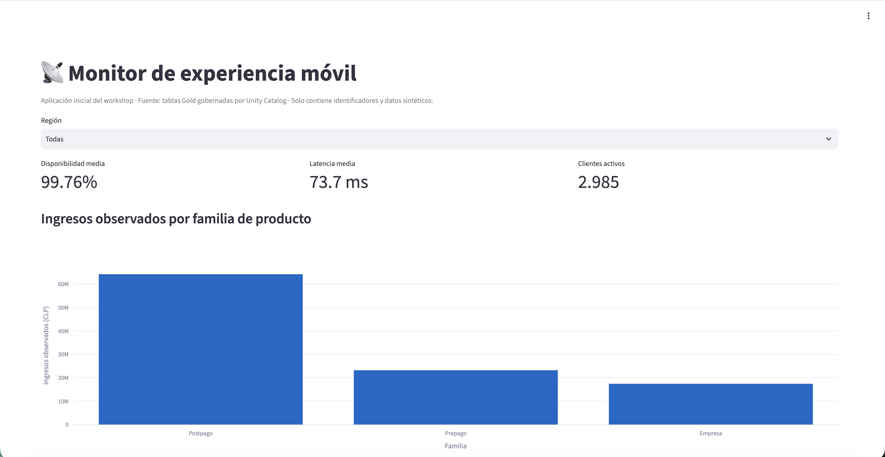

# Monitor de experiencia móvil — plantilla inicial

Databricks App deliberadamente simple para el ejercicio guiado del workshop. La
plantilla tiene una sola página, un filtro de región, tres KPI, un gráfico de
productos y una tabla de sitios. Los participantes comprueban así que una App
puede consumir la misma capa Gold utilizada por SQL, el dashboard y Genie sin
tener que diseñar una aplicación completa durante la sesión.

Los datos representan un operador móvil chileno ficticio y no incluyen nombres,
RUT, teléfonos, correos, direcciones ni otros datos personales.



## Contrato de datos

En Databricks la App consume, preferentemente, estas tablas Gold de Unity Catalog:

- `gold_network_hourly`
- `gold_site_daily_360`
- `gold_customer_360`
- `gold_customer_product_daily`
- `gold_incident_impact`

El catálogo, schema, warehouse y nombres alternativos se reciben únicamente por
variables de entorno. No se versionan identificadores de recursos ni credenciales.

| Variable | Obligatoria para modo remoto | Uso |
|---|---:|---|
| `DATABRICKS_WAREHOUSE_ID` | Sí | SQL Warehouse asociado a la App. |
| `TELCO_CATALOG` | Sí | Catálogo que contiene la capa Gold. |
| `TELCO_SCHEMA` | Sí | Schema que contiene la capa Gold. |
| `DATABRICKS_PROFILE` | Solo desarrollo local remoto | Perfil de la CLI; nunca se fija en código. |
| `TELCO_LOCAL_DATA_DIR` | No | Directorio alternativo para los CSV sintéticos. |
| `TELCO_APP_ROW_LIMIT` | No | Límite de filas, entre 1.000 y 500.000. |

Los nombres de las cinco tablas se pueden sobrescribir con
`TELCO_TABLE_NETWORK_HOURLY`, `TELCO_TABLE_SITE_DAILY_360`,
`TELCO_TABLE_CUSTOMER_360`, `TELCO_TABLE_CUSTOMER_PRODUCT_DAILY` y
`TELCO_TABLE_INCIDENT_IMPACT`.

## Contingencia local

Sin una configuración remota completa, `data_access.py` busca primero archivos
Gold en `data/generated`. Si no existen, deriva vistas equivalentes desde las
fuentes sintéticas. Durante la transición desde la versión anterior del workshop,
también crea una muestra Customer 360 determinista (`seed=42`) y anónima. Esta
muestra sirve solo para continuidad didáctica; en Databricks siempre se prioriza
la capa Gold.

Desde la raíz del repositorio:

```bash
uv run --extra app streamlit run apps/network-monitor/app.py
```

## Configuración en Databricks Apps

1. Cree la App y asocie un SQL Warehouse con permiso `CAN USE`.
2. Exponga como variables de entorno el ID de ese recurso, el catálogo y el
   schema elegidos para la sesión.
3. Conceda al service principal de la App `USE CATALOG`, `USE SCHEMA` y `SELECT`
   sobre las cinco tablas Gold.
4. Despliegue el contenido de esta carpeta y compruebe el filtro, los tres KPI,
   el gráfico y la tabla.
5. Revise `/logz` si la App activa la contingencia inesperadamente.

La autenticación remota usa las credenciales inyectadas por Databricks Apps. La
ejecución local remota usa el perfil indicado por `DATABRICKS_PROFILE`; no requiere
ni admite tokens guardados en el repositorio.

## Actividad guiada durante el workshop

La plantilla ya está creada y desplegada. Los participantes no provisionan una
App desde cero. En el bloque guiado:

1. abren `app.py` e identifican la carga de las tablas Gold;
2. cambian el título de la página;
3. cambian de región y verifican la actualización de los KPI;
4. añaden una cuarta métrica sencilla, por ejemplo NPS medio o clientes de riesgo alto;
5. ejecutan o vuelven a desplegar la App preparada por el instructor.

## Reto final: transformar la plantilla en una App moderna

La plantilla inicial es el punto de partida, no la solución del reto. La ejecución
completa se realiza después del workshop.

### Nivel 1 — estructura y diseño

- Crear navegación con las secciones **Resumen**, **Red**, **Clientes** y
  **Productos**.
- Mover los filtros a una barra lateral y añadir tecnología y segmento.
- Aplicar una jerarquía visual consistente para títulos, KPI y estados.
- Mantener una experiencia legible en pantallas de portátil.

### Nivel 2 — interacción

- Añadir un mapa de sitios coloreado por estado de salud.
- Crear una visualización de riesgo de clientes por segmento.
- Incorporar una vista de ingresos, ARPU o consumo por producto.
- Mostrar estados vacíos y mensajes de error comprensibles.

### Nivel 3 — producto listo para compartir

- Incorporar navegación clara, contexto de filtros y fecha de actualización.
- Aplicar accesibilidad básica: contraste, etiquetas y colores no ambiguos.
- Evitar consultas a Bronze, Silver o archivos CSV en modo remoto.
- Documentar permisos, contingencia y criterio de actualización de datos.

### Criterios de éxito

- La App usa exclusivamente tablas Gold gobernadas por Unity Catalog.
- Los filtros actualizan todos los elementos aplicables.
- Hay por lo menos tres secciones de negocio y cuatro visualizaciones.
- La App no muestra PII, secretos, IDs de infraestructura ni el nombre de una
  operadora real.
- El código mantiene separados el acceso a datos y la presentación.
