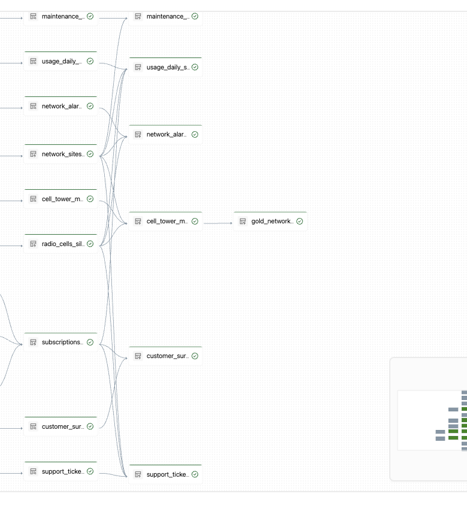

# Guía del instructor — Databricks de cero a héroe

## Resumen del workshop

**Público.** Ingenieros de datos, analistas y arquitectos que se inician en
Databricks. Los participantes deben saber navegar en aplicaciones web y comprender
SQL básico, tablas y schemas. Python es deseable, pero las modificaciones están
guiadas y son pequeñas.

**Objetivo.** Construir en 150 minutos una solución de experiencia móvil de punta
a punta: datos sintéticos, arquitectura medallion, gobierno, calidad, indicadores,
AI/BI Dashboard, Genie Space y una Databricks App inicial.

**Caso.** Analizar la relación entre calidad de red, incidentes, consumo, productos
y experiencia de clientes sintéticos de un operador móvil chileno ficticio. No se
utilizan nombres, RUT, teléfonos, correos, domicilios ni identificadores reales.

**Resultado.** Los participantes recorren once fuentes Bronze, once tablas Silver,
cinco tablas Gold, dos Metric Views, resultados `validated/quarantine`, un dashboard,
un Genie Space y una App simple. La modernización de la App es el reto posterior.

## Premisas y puntos de validación

- El catálogo existe antes de la sesión; los participantes no crean catálogos.
- Cada participante o grupo tiene permiso para crear un schema aislado.
- El componente utilizado es **Lakeflow Spark Declarative Pipelines** con Auto
  Loader, tablas declarativas y un DAG Bronze–Silver–Gold.
- DQX es **Databricks Labs DQX**; el entorno y la dependencia se preparan antes.
- “Genie Agent” se implementa como **AI/BI Genie Space**. Deep Research se muestra
  desde la interfaz cuando esté disponible; no se presupone una API pública
  equivalente para configurarlo.
- “Arquitectura FY27” no se presenta como arquitectura oficial sin un material
  corporativo validado. El workshop utiliza provisionalmente una visión conceptual:
  fuentes → UC → Lakeflow medallion → DQX → SQL/Metric Views → AI/BI, Genie y Apps.
- La disponibilidad de Genie, Apps, Metric Views y Deep Research depende de nube,
  región, plan, preview y permisos. Se valida antes de la sesión.

## Agenda exacta de 150 minutos

| # | Módulo | Min | Tell inicial | Show/práctica | Tell final | Resultado esperado |
|---:|---|---:|---:|---:|---:|---|
| 1 | Introducción | 15 | 8 | 5 | 2 | Componentes y flujo identificados |
| 2 | Unity Catalog | 18 | 3 | 13 | 2 | Objetos, permisos y volumen verificados |
| 3 | Lakeflow SDP | 20 | 3 | 15 | 2 | DAG Bronze–Silver–Gold ejecutado |
| 4 | DQX | 15 | 2 | 11 | 2 | Registros válidos y cuarentena separados |
| 5 | SQL Warehouse y Metric Views | 19 | 2 | 15 | 2 | Cinco Gold y dos Metric Views consultadas |
| 6 | AI/BI Dashboard | 21 | 2 | 17 | 2 | Dashboard filtrable con KPI de negocio |
| 7 | Genie Space | 15 | 2 | 11 | 2 | Preguntas en lenguaje natural verificadas |
| 8 | Databricks App inicial | 12 | 2 | 8 | 2 | Plantilla simple modificada y ejecutada |
| 9 | Reto y cierre | 10 | 7 | 2 | 1 | Reto de modernización seleccionado |
|  | Margen distribuido | 5 |  |  |  | Dudas, transiciones e imprevistos |
|  | **Total** | **150** | **31** | **97** | **17** | **64,7 % práctico** |

El margen no es un intervalo separado: reserve un minuto después de Unity Catalog,
Lakeflow, SQL, Dashboard y App. No elimine el lanzamiento del reto para recuperar
tiempo.

## 1. Introducción — 15 minutos

**Objetivo de aprendizaje.** Explicar qué problemas resuelve la plataforma y cómo
se conectan sus componentes.

**Tell — slides (8).** Silos de datos, Lakehouse/Data Intelligence Platform,
Unity Catalog, Lakeflow, SQL Warehouse, AI/BI, Genie y Apps. Presente el caso de
experiencia móvil y la visión conceptual FY27, marcándola como pendiente de la
referencia corporativa del cliente.

**Show (5).** Recorra Workspace, Catalog Explorer, SQL Editor, Workflows y Apps.
Muestre el diagrama medallion y las once fuentes, sin ejecutar aún la preparación.

**Tell final (2).** Pida a dos participantes que indiquen dónde se gobierna, procesa,
valida y consume el dato.

**Artefacto y verificación.** Ninguno; todos deben localizar catálogo, warehouse y
repositorio.

**Contingencia.** Use las capturas sanitizadas del repositorio si una pantalla no
está disponible.

## 2. Unity Catalog — 18 minutos

**Objetivo de aprendizaje.** Comprender metastore → catálogo → schema → tabla/volume,
permisos, descubrimiento y lineage.

**Tell — slides (3).** Jerarquía, `USE CATALOG`, `USE SCHEMA`, `SELECT`, ownership y
la importancia de gobernar datos operacionales y de clientes.

**Show — consola (3).** Abra Catalog Explorer, propiedades de una tabla sintética,
permisos y lineage.

**Ejercicio guiado (10).** Abra `02_unity_catalog.sql`, defina un schema aislado,
verifique el volume y ejecute consultas `SHOW`. Luego abra `02_read_csvs.py`, lea los
CSV con schema explícito y compare una muestra con el contrato de datos.

**Tell final (2).** Confirme que catálogo, schema y volume son visibles y que no se
creó ningún catálogo desde el notebook.

**Artefacto y verificación.** Schema del workshop y acceso a los archivos sintéticos;
`SHOW VOLUMES` y los conteos de las once fuentes deben responder.

**Contingencia.** Use un schema compartido preparado. Sin acceso a volumes, continúe
con las tablas checkpoint. Sin Unity Catalog, convierta el módulo en demostración.

## 3. Lakeflow Spark Declarative Pipelines — 20 minutos

**Objetivo de aprendizaje.** Comparar una canalización declarativa con una secuencia
Spark imperativa y recorrer un DAG medallion completo.

**Tell — slides (3).** Auto Loader, `dp.table`, dependencias declarativas,
expectations, observabilidad, recomputación y operación administrada. Explique que
Spark sigue siendo el motor: SDP reduce el código operacional y hace explícito el
grafo, pero no “reemplaza PySpark”.

**Show (4).** Abra `03_lakeflow_pipeline.py`. Compare una transformación declarativa
con el bloque equivalente de `03_alt_spark_etl.py`; muestre cómo el framework infiere
el DAG y centraliza métricas.

**Ejercicio guiado (11).** Abra el pipeline preparado, compruebe destino y parámetros,
ejecute un update y recorra las once Bronze, once Silver y Gold preliminares. Abra
las métricas de expectations y el detalle de una dependencia.

**Tell final (2).** Los participantes explican una ventaja operacional y un caso en
que ejecutar Spark tradicional como contingencia es suficiente.

**Artefacto y verificación.** Update exitoso y DAG Bronze–Silver–Gold sin nodos
fallidos.

**Contingencia.** Ejecute `03_alt_spark_etl.py`. Si Auto Loader no accede al volume,
use las tablas checkpoint ya creadas.

## 4. DQX — 15 minutos

**Objetivo de aprendizaje.** Aplicar reglas declarativas y separar datos confiables
de registros que requieren corrección.

**Tell — slides (2).** Completitud, validez, unicidad, consistencia, severidades y
la diferencia entre observación en SDP y cuarentena detallada con DQX.

**Show (3).** Muestre `config/dqx_rules.yml`, la carga de reglas y las columnas de
diagnóstico producidas por DQX.

**Ejercicio guiado (8).** Ejecute `04_dqx_quality.py`, compare `validated` y
`quarantine`, inspeccione tres impurezas intencionales y cambie un umbral de warning.

**Tell final (2).** Confirme que errores se aíslan, warnings permanecen observables
y Gold consume exclusivamente registros validados.

**Artefacto y verificación.** Tablas de calidad y resumen DQX con registros en ambas
rutas.

**Contingencia.** Ejecute `04_alt_sql_quality.sql` si la dependencia no carga en dos
minutos. Mantenga visibles las expectations del pipeline.

## 5. SQL Warehouse y Metric Views — 19 minutos

**Objetivo de aprendizaje.** Transformar datos técnicos en objetos analíticos y una
semántica reutilizable.

**Tell — slides (2).** SQL Warehouse, Photon, tablas Gold y Metric Views con
dimensiones y medidas gobernadas.

**Show (4).** Ejecute una consulta en `05_sql_queries.sql`, abra el perfil y muestre
una medida de `mv_network_quality`.

**Ejercicio guiado (11).** Cree o consulte las cinco Gold y las dos Metric Views.
Obtenga calidad por región, sitios críticos, clientes de alto riesgo, ingresos y
experiencia por producto. Cambie un filtro sin alterar la definición semántica.

**Tell final (2).** Dashboard y Genie consumirán Gold/Metric Views; la App inicial
consume Gold por un contrato separado de acceso a datos.

**Artefacto y verificación.** Cinco tablas Gold y dos Metric Views consultables.

**Contingencia.** Ejecute Spark SQL en un notebook. Si las etapas anteriores fallaron,
use `05_checkpoint_if_needed.sql`.

## 6. AI/BI Dashboard — 21 minutos

**Objetivo de aprendizaje.** Construir la principal experiencia visual del hands-on.

**Tell — slides (2).** Datasets, canvas, filtros, publicación y permisos.

**Show (4).** Cree un dataset sobre una Gold o Metric View y añada un KPI y una barra
por región.

**Ejercicio guiado (13).** Siga `DASHBOARD_GUIDE.md`: cree indicadores de red y
clientes, tendencia, comparación regional, tabla de sitios y filtros. Verifique que
los filtros actualicen todos los elementos relacionados.

**Tell final (2).** Compare el dashboard con las consultas SQL y publique solo si los
permisos del grupo están listos.

**Artefacto y verificación.** Dashboard filtrable con al menos cuatro visualizaciones.

**Contingencia.** Duplique el dashboard de referencia y cada participante añade un
filtro y una visualización. Sin AI/BI, ejecute los datasets en SQL Editor.

## 7. Genie Space — 15 minutos

**Objetivo de aprendizaje.** Explorar los mismos datos en lenguaje natural y validar
el SQL generado.

**Tell — slides (2).** Fuentes confiables, instrucciones, sinónimos, ejemplos y
diferencia entre Chat y Deep Research.

**Show (3).** Abra el Genie Space preparado y sus instrucciones. Ejecute una pregunta
de red en modo Chat.

**Ejercicio guiado (8).** Ejecute dos preguntas Chat documentadas, inspeccione el SQL
y refine una consulta. El instructor muestra dos ejemplos de Deep Research cuando la
funcionalidad esté habilitada; esta parte es demostrativa por disponibilidad.

**Tell final (2).** Compare pregunta, SQL, resultado y fuente. Una respuesta fluida no
dispensa la verificación del SQL.

**Artefacto y verificación.** Conversación con dos respuestas Chat correctas y cuatro
prompts de referencia documentados.

**Contingencia.** Use capturas sanitizadas y las consultas certificadas del SQL Editor.

## 8. Databricks App inicial — 12 minutos

**Objetivo de aprendizaje.** Entender la estructura mínima de una App que consulta
Gold, sin resolver el reto visual.

**Tell — slides (2).** `app.py`, `app.yaml`, recurso SQL Warehouse, service principal
y grants de Unity Catalog.

**Show (3).** Abra `apps/network-monitor`: muestre la separación entre `data_access.py`
y presentación. Ejecute la plantilla de una página con un filtro, tres KPI, un gráfico
y una tabla.

**Ejercicio guiado (5).** Cambie el título; seleccione una región; añada una cuarta
métrica sencilla; ejecute localmente o vuelva a desplegar la App preparada. Los participantes
no crean el recurso Databricks App desde cero.

**Tell final (2).** Confirme que la fuente es Gold y explique que simplicidad visual
es intencional: el reto es transformarla en un producto moderno.

**Artefacto y verificación.** Plantilla funcional con el cambio del participante.

**Contingencia.** Use la App prepublicada o el modo local. Si el deploy tarda más de
tres minutos, continúe y deje la actualización en segundo plano.

## 9. Reto final y cierre — 10 minutos

**Tell inicial (7).** Presente el reto posterior al workshop: convertir la plantilla simple en
una App moderna. Muestre solo el objetivo visual, no una solución completa.

**Show (2).** Señale dónde agregar navegación, filtros y componentes; cada participante
elige un nivel en `apps/network-monitor/README.md`.

**Tell final (1).** Recapitule el flujo de las fuentes hasta las experiencias de
consumo y acuerde cómo compartir evidencias.

**Criterio mínimo del reto.** Tres secciones de negocio, cuatro visualizaciones,
filtros consistentes, diseño legible, Gold como única fuente remota y ausencia de PII.

**Extensiones.** Mapa de sitios, riesgo por segmento, portafolio de productos,
responsividad, accesibilidad, estados vacíos, registro de actualización y observabilidad.

## Riesgos y control del tiempo

| Riesgo | Contingencia | Criterio de decisión |
|---|---|---|
| Permiso de UC | Schema compartido y checkpoints | Primera denegación de creación |
| Compute atrasado | Serverless/warehouse y demo | No disponible en el minuto 10 |
| Lakeflow no disponible | `03_alt_spark_etl.py` | Error de entitlement o provisionamiento |
| DQX no instala | `04_alt_sql_quality.sql` | Instalación supera dos minutos |
| Warehouse no disponible | Notebook Spark SQL | Inicio supera tres minutos |
| Dashboard o Genie no disponible | Artefacto del instructor y SQL | Función ausente en la interfaz |
| Deep Research no disponible | Capturas y prompts preparados | Opción ausente en el Genie Space |
| App lenta o no disponible | Modo local o App prepublicada | Deploy supera tres minutos |
| Atraso general | Próximo ejercicio se convierte en demo | Módulo supera tres minutos |

Use checkpoints para saltar una implementación sin romper la narrativa. No recorte
el Dashboard, que es la principal construcción visual, ni el lanzamiento del reto.
